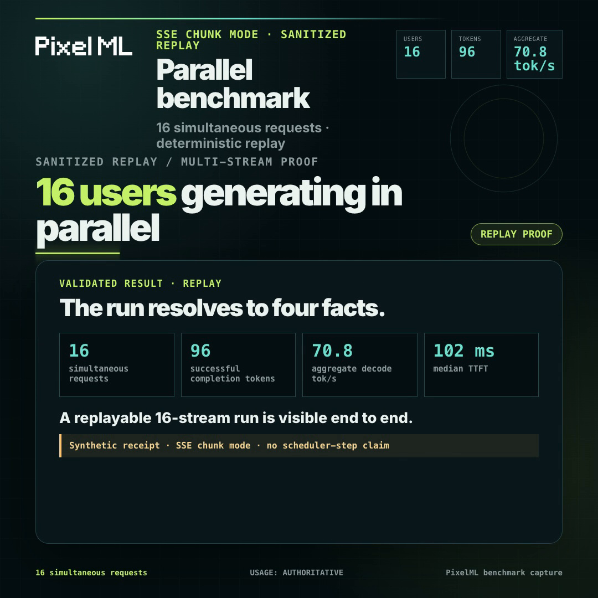

# Parallel benchmark capture

Live OpenAI-compatible concurrency benchmark dashboard and HyperFrames video
publisher.

[](docs/parallel-benchmark-capture.mp4)

## TL;DR

The tool shows **16 users generating in parallel** in a responsive stream grid,
then resolves to four measured run facts and the winning recipe. `LIVE` mode
keeps the endpoint and key in a local Node controller. `REPLAY` mode uses a
frozen, synthetic receipt so CI, screenshots, and HyperFrames renders are
deterministic.

The current checked-in receipt is a public-safe replay fixture. It is labeled
`SSE CHUNK MODE`; no scheduler-step claim is made.

## Quickstart

```sh
npm test
npm run demo
```

Open `http://127.0.0.1:4173`. The demo starts the mock OpenAI-compatible SSE
endpoint and the dashboard controller, then automatically replays the
sanitized C16 fixture. Stop with `Ctrl-C`.

Replay without a server:

```sh
npm run replay -- --concurrency 16
```

Run a real private capture only when the owning experiment has supplied a
sanitized runtime handoff:

```sh
BENCH_ENDPOINT='https://endpoint.invalid/v1/chat/completions' \
OPENAI_API_KEY='set-in-your-shell-only' \
BENCH_MODEL='model-alias' \
npm run capture -- --concurrency 16 --prompt-file ./prompts.local.json
```

The endpoint and key are consumed by the controller process only. They are not
returned by the API, written to receipts, or included in the browser bundle.
Replace the placeholder endpoint with the operator-provided private endpoint;
do not commit it.

For a version-gated ParallelHue sidecar, opt in explicitly and keep the
NDJSON file local to the controller process:

```sh
BENCH_ENDPOINT='https://endpoint.invalid/v1/chat/completions' \
OPENAI_API_KEY='set-in-your-shell-only' \
BENCH_MODEL='model-alias' \
BENCH_TELEMETRY_MODE='EXACT SCHEDULER STEP' \
BENCH_PARALLELHUE_EVENTS_FILE='./telemetry.local.ndjson' \
BENCH_PARALLELHUE_RUN_ID='0123456789abcdef0123456789abcdef' \
BENCH_PARALLELHUE_EXPORT_SHA256='0123456789abcdef0123456789abcdef0123456789abcdef0123456789abcdef' \
npm run capture -- --concurrency 16
```

The adapter is pinned to the public ParallelHue revision
[`be9b02680f0a2326cc7068dc592dd0ad2fe7de71`](https://github.com/hikarioyama/ParallelHue/tree/be9b02680f0a2326cc7068dc592dd0ad2fe7de71).
The owning experiment must supply the fresh 32-character run ID and its
same-run, sanitized sidecar and its SHA-256 fingerprint together. The
controller creates a fresh local run binding, claims the handoff once through an
atomic private ledger transaction, and retains every claim so a previously
consumed run ID or export fingerprint is refused even after restart; lock
timeouts and ledger corruption fail closed. For each stream it sends the official `ph1_<run_id>_<stream>` value
as the request body's `request_id`, then requires the sidecar's run ID, request
ID, and `choice_index: 0` to match before reconciling text and token IDs. A
stale, replayed, or differently bound sidecar fails closed before any request
is sent. Without this explicit opt-in, all ordinary OpenAI-compatible streams
remain `SSE CHUNK MODE`.

## Modes and metrics

- `LIVE` performs real concurrent requests through the controller.
- `REPLAY` feeds the same event schema from the frozen fixture.
- Ordinary OpenAI SSE is shown as `SSE CHUNK MODE`.
- `EXACT SCHEDULER STEP` is reserved for a proven, version-gated telemetry
  adapter; transport chunks never become scheduler steps by inference.
- Aggregate decode is successful completion tokens divided by run wall time.
- Per-request throughput is reported as a distribution, with TTFT,
  completion count, and explicit failure/wedge labels.
- Presets are 1/2/4/8/16, with arbitrary positive concurrency supported.

## Project layout

```text
bin/parallel-benchmark.mjs     CLI entry point
src/controller.mjs             HTTP controller and concurrent capture
src/schema.mjs                 event/run validation and sanitization
src/metrics.mjs                usage-authoritative metrics
src/mock-endpoint.mjs          deterministic OpenAI-compatible SSE server
public/index.html               responsive dashboard
fixtures/replay-c16.json       sanitized replay source of truth
schemas/*.schema.json           JSON Schema contracts
schemas/fixtures/*.json         valid/invalid schema probes
hyperframes/                    editable replay-only video project
```

## HyperFrames render

The video uses replay data only. From `hyperframes/`:

```sh
npm install
npm run build
npm exec --yes --package=hyperframes@0.8.22 -- hyperframes check .
npm exec --yes --package=hyperframes@0.8.22 -- hyperframes snapshot . --at 0.4,2.2,4.8,7.7 --output ./snapshots
npm exec --yes --package=hyperframes@0.8.22 -- hyperframes render . --quality high --workers 2 --output ../docs/parallel-benchmark-capture.mp4
ffmpeg -y -i ../docs/parallel-benchmark-capture.mp4 -vf 'select=eq(n\,239)' -fps_mode vfr -frames:v 1 -update 1 ../docs/parallel-benchmark-capture-poster.png
```

The render command writes directly to the linked `docs/` artifact, and the
last command regenerates its poster from the final frame. The composition uses
replay data only; it has no live endpoint dependency.

The committed `hyperframes/replay-data.json` is a copy of the public replay
receipt.

## Attribution

See [`NOTICE`](NOTICE). The event adapter is informed by the MIT-licensed
[ParallelHue](https://github.com/hikarioyama/ParallelHue) project, while this
repository keeps its own event schema, controller, and UI implementation.
